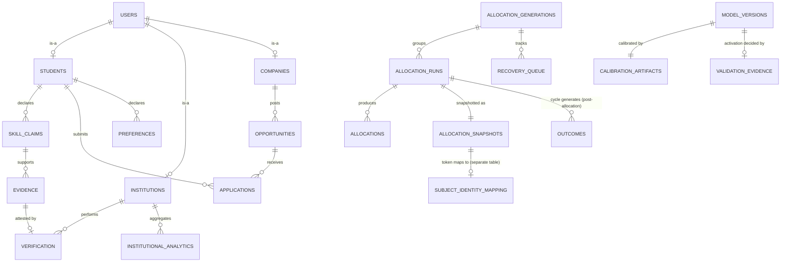

# ANCHOR — DATABASE & DATA MODEL SPECIFICATION

```text
Source of Truth:
ANCHOR_MASTER_DESIGN.md

Product Narrative:
ANCHOR_LATEST_IDEA.md

Status:
Derived downstream specification

Historical review documents:
Reference only — not authoritative
```

*[Derived logical model — entities and fields are implementation structure required to realize the Master's locked rules (Master Part 11); not independently reviewed line-by-line.]*

---

## 1. Entity Catalogue

| Table | Purpose | Key fields | Immutable fields | Versioned fields | Privacy class | Tenant ownership |
|---|---|---|---|---|---|---|
| `users` | Base account record | id, role, auth credentials | id | — | Direct identity | Platform |
| `students` | Student profile | user_id, profile fields, `tiebreak_key` | `tiebreak_key` | — | Direct identity (linked) | Self |
| `institutions` | Institution account | id, status (`PENDING`/`ACTIVATED`) | id | — | Org identity | Self |
| `companies` | Company account | id, status (`PENDING`/`ACTIVATED`) | id | — | Org identity | Self |
| `opportunities` | Posted role | id, company_id, requirements (E/F inputs), capacity | id | requirement-version | Non-sensitive | Company |
| `applications` | Candidate interest in an opportunity | id, candidate_id, opportunity_id | id | — | Pseudonymous (via snapshot) | Student + Company |
| `skills` | Canonical skill graph nodes | id, name, adjacency edges | id | — | Non-sensitive | Platform |
| `skill_claims` | Student's claimed skill | id, student_id, skill_id | id | — | Pseudonymous | Student |
| `evidence` | Supporting evidence for a claim | id, skill_claim_id, content, status (cap 5/claim) | id | verification-version | Pseudonymous | Student |
| `verification` | Institution attestation event | id, evidence_id, verifier (Faculty), `verification_tier` | id | — | Pseudonymous | Institution |
| `preferences` | Candidate's declared ranked list | id, candidate_id, ranked opportunity list | id (per submission) | — | Pseudonymous (via snapshot) | Student |
| `allocation_runs` | One DA execution | id, cycle, `allocation_generation`, status | scores/capacities during execution (freeze invariant) | policy/model versions | Pseudonymous | Platform |
| `allocation_generations` | Groups a run + its recoveries | id, root_run_id | id | — | Pseudonymous | Platform |
| `allocations` | A candidate–opportunity match | id, run_id, candidate_id, opportunity_id, state | — | — | Pseudonymous | Platform |
| `recovery_queue` | Pending recovery entries | id, candidate_id, allocation_generation, status, `retry_count`, `parent_run_id` | — | — | Pseudonymous | Platform |
| `model_versions` | Trained `O` model artifacts | id, model_hash, feature_contract_ref | id, hash | self | Non-sensitive | Platform |
| `calibration_artifacts` | Calibration output per model version | id, model_version_id, Brier/log-loss/curve | id | self | Non-sensitive | Platform |
| `validation_evidence` | Frozen activation-decision record | id, model_version_id, VALIDATION cycle range, event counts, Brier improvement, threshold, leakage result, seed results | all fields once written | self | Non-sensitive | Platform |
| `allocation_snapshots` | Immutable per-run computational record | id, run_id, `candidate_subject_token`, snapshot_blob, snapshot_hash, versions, tiebreak values, `policy_alpha`, `random_seed` | entire record | self | Pseudonymous/potentially linkable | Platform |
| `subject_identity_mapping` | Token → real identity | candidate_subject_token, student_id | — | — | Direct identity | Platform (highly restricted) |
| `audits` | Action/access log | id, actor, action, object, tenant, timestamp | id (append-only) | — | Mixed | Platform |
| `outcomes` | Generated `OFFER_EXTENDED` events | id, cycle, candidate_id, opportunity_id, label, eligible-for-training-as-of | id | — | Pseudonymous | Platform |
| `institutional_analytics` | Peer-institution aggregates | id, institution_id, metric, sample_size (≥10 to display) | — | — | Aggregated only | Institution + Admin |

## 2. Entities of Particular Attention

### 2.1 `allocation_runs`

- One row per DA execution for a given cycle.
- `allocation_generation` links a run to its lineage of recovery runs.
- Scores, capacities, preferences, and version references are **immutable for the duration of execution** (freeze-at-run-start invariant, FR-011) — this is an execution-window property, not a general table mutability rule; the row's `status` field still transitions per the governance state machine (ANCHOR_STATE_MACHINES.md).
- Must carry `outcome_signal_source: ML | HEURISTIC_FALLBACK` per run.

### 2.2 `allocation_generations`

- Groups a root `allocation_runs` row together with every recovery run derived from it.
- `root_run_id` provides lineage; superseded runs are marked `SUPERSEDED`, never deleted.

### 2.3 `allocations`

- A single candidate–opportunity match belonging to exactly one `run_id`.
- `state` follows the allocation lifecycle (ANCHOR_STATE_MACHINES.md): `DRAFT → PROPOSED → ... → PUBLISHED → ACCEPTED / REJECTED-VACATED`.

### 2.4 `recovery_queue`

- At most one `ACTIVE` entry per candidate per `allocation_generation` (FR-014) — this is a hard invariant, enforced at write time, not merely a query filter.
- Carries `retry_count`, escalating past a defined (currently Configurable/unspecified numeric) threshold to an admin-triggered full market rerun.
- `parent_run_id` disambiguates recovery-vs-full-rerun precedence.

### 2.5 `model_versions`

- Immutable once written: `id`, `model_hash` never change post-creation.
- `feature_contract_ref` ties the artifact to the locked `O` feature contract (primitives only — see ANCHOR_AI_DS_SPEC.md) for leakage-check auditing.

### 2.6 `calibration_artifacts`

- One row per `model_versions` row; stores Brier score, log loss, and calibration curve — computed for every model version, not only activated ones.

### 2.7 `validation_evidence`

- **All fields immutable once written.** This is the frozen record justifying (or declining) `MODEL_ACTIVATION`: VALIDATION-partition event counts, Brier-score improvement, threshold value in force, leakage-check result, multi-seed results.
- Written by the `model_validate_activate` job regardless of whether the gate passes — a fallback decision is still evidence-backed and recorded, not silently unlogged.

### 2.8 `allocation_snapshots`

- **The entire record is immutable once written** — both `snapshot_blob` and `snapshot_hash` are required at write time; neither is ever recomputed or altered afterward.
- Contains `candidate_subject_token` (opaque, never directly identifying), plus pseudonymous/potentially-linkable computational data: opportunity_state, preferences, eligibility_results, capacities, scores, `model_hash`, all relevant version fields (`algorithm_version`, `calibration_version`, `dataset_version`, `generator_version`), actual tiebreak values used, `policy_alpha`, `random_seed`.
- **Must not be made mutable merely because a typical CRUD schema would default to it.** Any downstream re-verification re-derives `snapshot_hash` from the stored `snapshot_blob`; it never overwrites either.

### 2.9 `subject_identity_mapping`

- Separate, mutable table: `candidate_subject_token → student_id`.
- Access-controlled at a stricter tier than general snapshot access (see ANCHOR_SECURITY_PRIVACY.md) — treated as a distinct, higher-sensitivity authorization tier.
- The **only** table touched by a deletion/pseudonymization request. `allocation_snapshots` is never touched by such a request — its immutability and reproducibility guarantee must never be broken by a privacy action.

### 2.10 `outcomes`

- One row per `(cycle, candidate_id, opportunity_id)` `OFFER_EXTENDED` event, generated for the **entire eligible-pair universe**, not just allocated pairs.
- `eligible_for_training_as_of` marks when the row becomes usable as TRAIN/CALIBRATION data — Cycle T's own outcomes are never usable for Cycle T's own scoring/activation (FR-009).

### 2.11 `audits`

- Append-only; `id` is the only "immutable field" in the conventional sense because the entire row is never updated after insert.
- Every authorization-decision-relevant event is logged here: actor, action, object, tenant, timestamp.

## 3. Relationship Diagram (Mermaid)



## 4. Cross-Reference

Full lifecycle/state semantics for `allocation_runs.status`, `recovery_queue.status`, `verification.verification_tier`, and profile visibility fields: see ANCHOR_STATE_MACHINES.md. Endpoint-level read/write access per table: see ANCHOR_API_SPEC.md and ANCHOR_SECURITY_PRIVACY.md.
